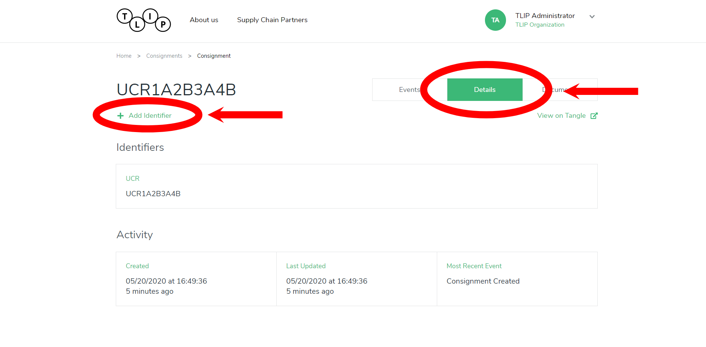
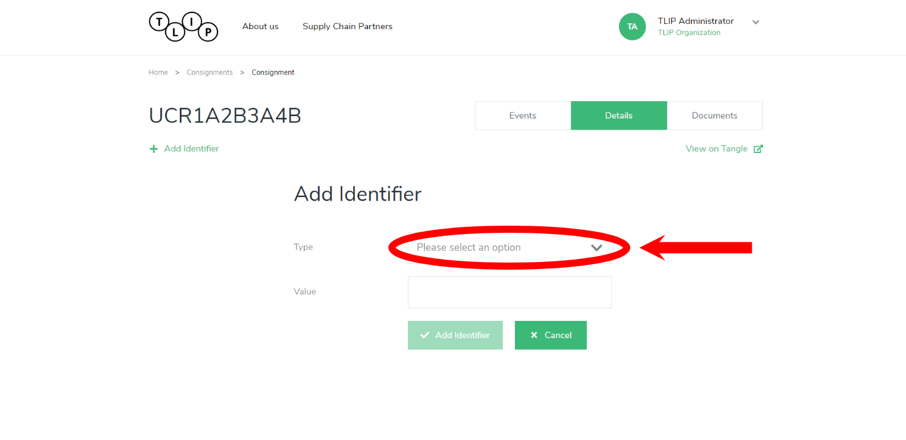
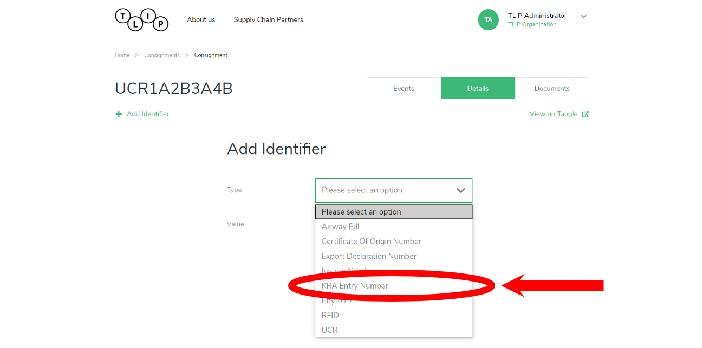
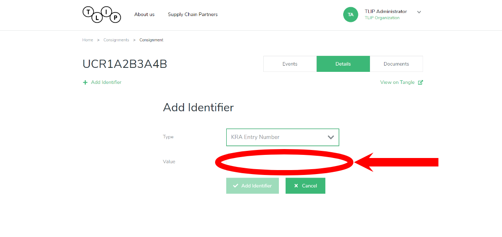
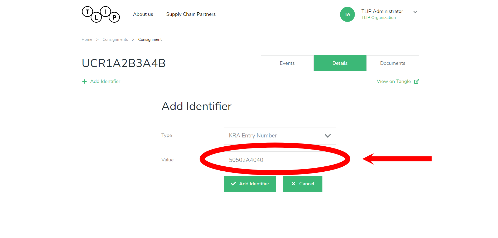
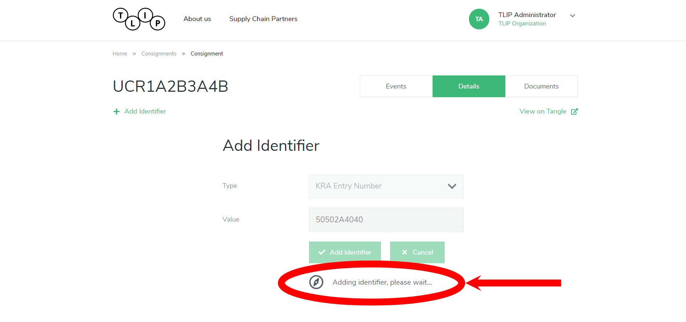
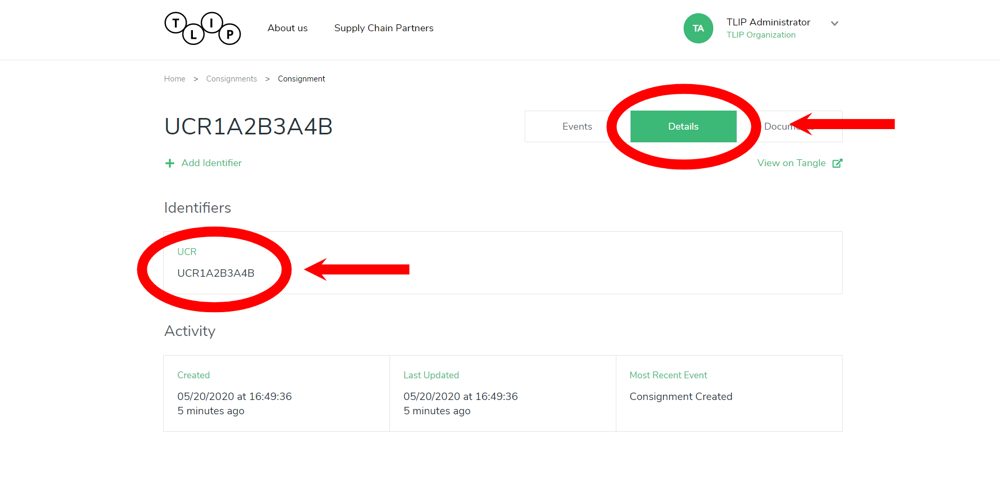

# Adding an Identifier

To add an identifier, click on the Add Identifier link on the Details tab.

Only an identifierfrom the existing types can be added to a consignment. One can select one from an existing list of Types.

For our demo, we'll choose the KRA Entry Number

After which,we'll add the actual KRA Entry Number

We save it by clicking the Add Identifier button

The identifier we just created will now show up in the Details Page.

